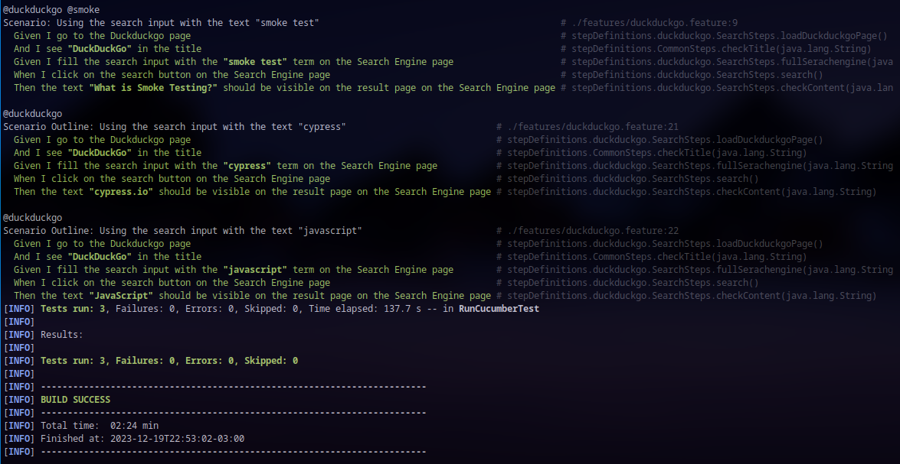
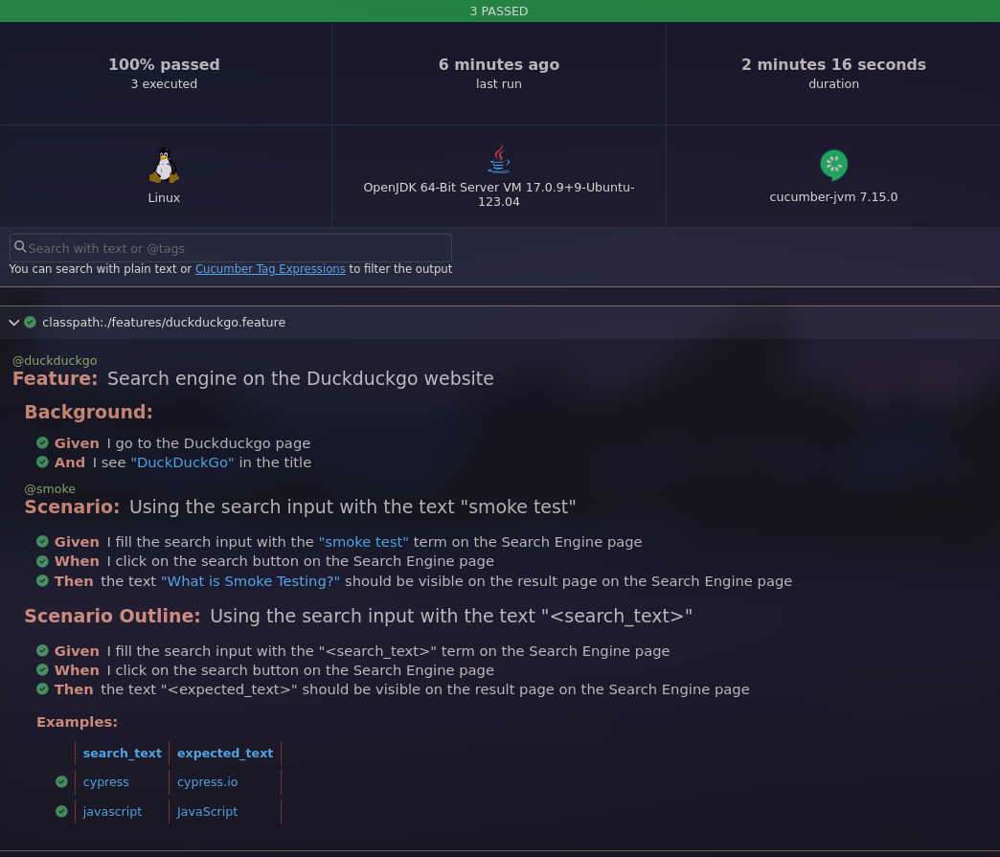

# BDD base project: Cucumber + Selenium + Java


Basic example of using Cucumber and Selenium with Java (BDD). This `Gherkin` example includes:
- Basic Scenario
- Scenario Outline
- Tagged tests

# Tested Scenarios

**WIP**

# Table of contents

* [Get started](#get-started)
  * [Requirements](#requirements)
* [How to run the tests](#how-to-run-the-tests)
  * [Running tests](#running-tests)
  * [Running tagged tests](#running-tagged-tests)
    * [Running tagged smoke tests](#running-tagged-smoke-tests)
    * [Running using customized tags](#running-using-customized-tags)
* [Developers](#developers)
  * [Set up the Git hooks custom directory](#set-up-the-git-hooks-custom-directory)
  * [Static code analysis tools](#static-code-analysis-tools)
    * [Java static checkers](#java-static-checkers)
    * [Run manually](#run-manually)
* [License](#license)

# Get started

## Requirements

* [Maven](https://maven.apache.org/) (>=3.8.7).
* [Firefox browser](https://www.mozilla.org/en-US/firefox/new/).

# How to run the tests

## Running tests

```bash
mvn test
```



**HTML report**:



## Running tagged tests

### Running tagged smoke tests

```bash
mvn test -Dcucumber.filter.tags="@smoke"
```

### Running using customized tags

```bash
mvn test -Dcucumber.filter.tags="@smoke and @duckduckgo"
```

*more details*: [tags](https://cucumber.io/docs/cucumber/api/?lang=java#running-a-subset-of-scenarios)

### Developers

#### Set up the Git hooks custom directory

After cloning the repository run the following command in the repository root, this ensures that static analysis tools
are run before each push into the repository to maintain the quality of the project:

```bash
git config core.hooksPath .githooks
```

#### Static code analysis tools

These are the static analysis tools that will help us to follow good practices and style guides of our source code. We
will be using the following tools, which will be executed when generating a new push in the repository (git hooks).

##### Java static checkers

Tools used:

* [spotless](https://github.com/diffplug/spotless): Spotless is a development tool to help programmers write Java code
  that adheres to a coding standard.

##### Run manually

```bash
mvn spotless:check
```

# License

[MIT](./LICENSE)
